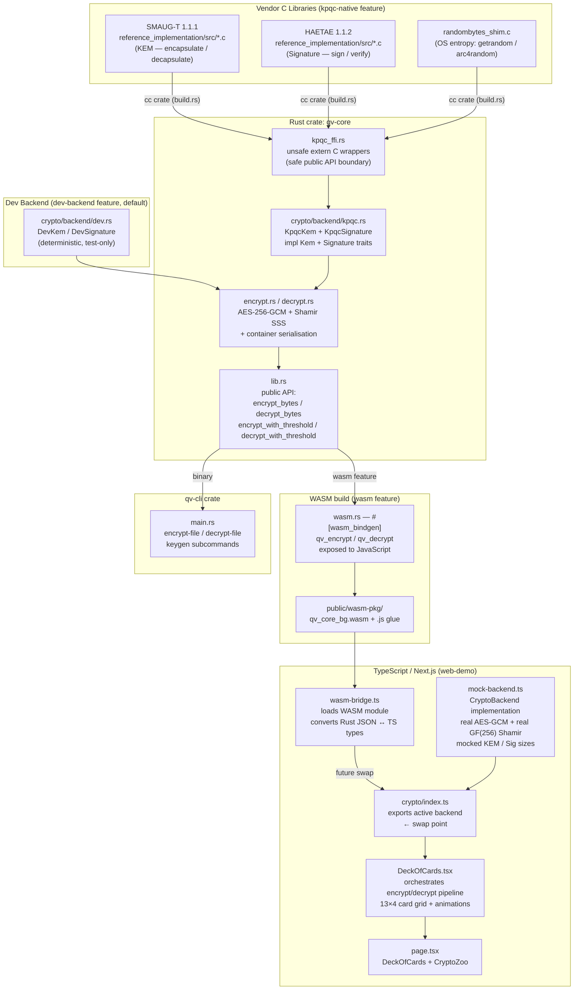
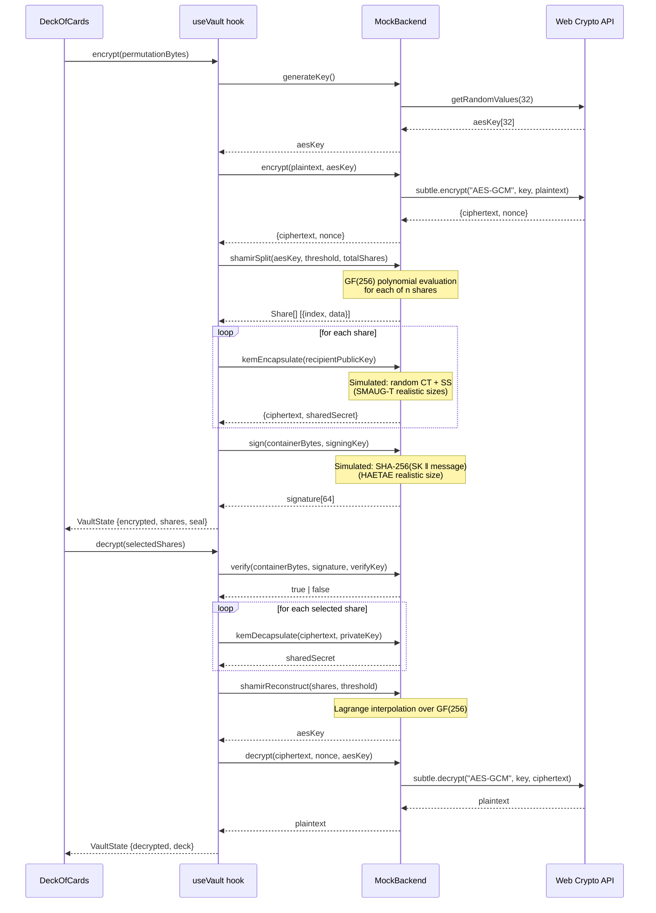

# Quantum Vault — Full Architecture

This document covers the complete system architecture from the C reference
implementations through the Rust FFI layer, WASM compilation, TypeScript
bridge, and browser-rendered demo UI.

---

## 1. Full Pipeline: C → Rust → WASM → TypeScript → Browser



---

## 2. Mock Backend Data Flow



---

## 3. Backend Interface Contract

The `CryptoBackend` interface in [web-demo/src/crypto/types.ts](../web-demo/src/crypto/types.ts) defines the contract every backend implementation must satisfy:

```typescript
interface CryptoBackend {
  // ── Key generation ─────────────────────────────────────────────────────

  /** Generate a random 256-bit AES key. */
  generateKey(): Promise<Uint8Array>;                       // 32 bytes

  /** Generate a KEM keypair. */
  kemKeygen(): Promise<{ publicKey: Uint8Array; privateKey: Uint8Array }>;

  /** Generate a signature keypair. */
  sigKeygen(): Promise<{ publicKey: Uint8Array; privateKey: Uint8Array }>;

  // ── Symmetric encryption ───────────────────────────────────────────────

  /** AES-256-GCM encrypt. Returns { ciphertext, nonce }. */
  encrypt(plaintext: Uint8Array, key: Uint8Array): Promise<{
    ciphertext: Uint8Array;
    nonce:      Uint8Array;   // 12 bytes
  }>;

  /** AES-256-GCM decrypt. */
  decrypt(
    ciphertext: Uint8Array,
    nonce:      Uint8Array,
    key:        Uint8Array,
  ): Promise<Uint8Array>;

  // ── Shamir Secret Sharing ──────────────────────────────────────────────

  /** Split secret into n shares, threshold t required to reconstruct. */
  shamirSplit(
    secret:      Uint8Array,
    totalShares: number,
    threshold:   number,
  ): Promise<Share[]>;

  /** Reconstruct secret from at least t shares. */
  shamirReconstruct(shares: Share[], threshold: number): Promise<Uint8Array>;

  // ── KEM (Key Encapsulation Mechanism) ──────────────────────────────────

  /** Encapsulate a shared secret under publicKey. */
  kemEncapsulate(publicKey: Uint8Array): Promise<{
    ciphertext:   Uint8Array;
    sharedSecret: Uint8Array;
  }>;

  /** Decapsulate a shared secret using privateKey. */
  kemDecapsulate(
    ciphertext:  Uint8Array,
    privateKey:  Uint8Array,
  ): Promise<Uint8Array>;

  // ── Digital signature ──────────────────────────────────────────────────

  /** Sign message with signingKey. */
  sign(message: Uint8Array, signingKey: Uint8Array): Promise<Uint8Array>;

  /** Verify signature against verificationKey. Returns true if valid. */
  verify(
    message:           Uint8Array,
    signature:         Uint8Array,
    verificationKey:   Uint8Array,
  ): Promise<boolean>;
}

interface Share {
  index: number;       // 1-based share index (never 0)
  data:  Uint8Array;   // share payload — same size as the secret
}
```

### WASM Swap-In Point

[web-demo/src/crypto/index.ts](../web-demo/src/crypto/index.ts) is the **only file that must change** to switch from mock to WASM:

```typescript
// Mock (current):
export { mockBackend as backend } from './mock-backend';

// WASM (after `npm run wasm:build`):
export { wasmBackend as backend } from './wasm-backend';
```

The WASM backend must implement `CryptoBackend` using `qv_encrypt` / `qv_decrypt` exported from `public/wasm-pkg/qv_core.js`.

---

## 4. FFI Safety Invariants

All unsafe FFI is confined to [`crates/qv-core/src/crypto/backend/kpqc_ffi.rs`](../crates/qv-core/src/crypto/backend/kpqc_ffi.rs).
The public functions in that module are **safe Rust** wrappers; the `unsafe` keyword is only used at the `extern "C"` call site inside each function body.

### SMAUG-T boundaries

| Function | C symbol | Pointer invariants |
|----------|----------|--------------------|
| `smaug_t_keypair()` | `cryptolab_smaugt_mode3_keypair` | `pk` points to `≥ SMAUG_T_PK_BYTES` (1088) initialised allocation; `sk` to `≥ SMAUG_T_SK_BYTES` (1312). Both must remain valid for the duration of the call. Rust allocates both on the stack as `vec![0u8; N]` before the call. |
| `smaug_t_enc(pk)` | `cryptolab_smaugt_mode3_enc` | `pk` must be exactly `SMAUG_T_PK_BYTES` (checked before the call). `ct` and `ss` are freshly allocated output buffers. |
| `smaug_t_dec(sk, ct)` | `cryptolab_smaugt_mode3_dec` | Both `sk` and `ct` are validated for exact byte lengths before the call. The C function reads them as `const` pointers; no aliasing with the output `ss`. |

### HAETAE boundaries

| Function | C symbol | Pointer invariants |
|----------|----------|--------------------|
| `haetae_keypair()` | `cryptolab_haetae_mode3_keypair` | `vk` → `≥ HAETAE_PK_BYTES` (1472); `sk` → `≥ HAETAE_SK_BYTES` (2112). Rust-allocated vecs, distinct allocations, no aliasing. |
| `haetae_sign(sk, message)` | `cryptolab_haetae_mode3_signature` | `sig` is allocated as `vec![0u8; HAETAE_SIG_BYTES]` (2349). `siglen` is a stack `usize` passed by mutable pointer — C writes the actual length. `ctx` and `ctxlen` are `null` / `0` (no signing context). `sk` is validated for exact length. After return, `sig` is truncated to `*siglen`. |
| `haetae_verify(pk, message, signature)` | `cryptolab_haetae_mode3_verify` | `pk` validated to `HAETAE_PK_BYTES`. Signature length checked to be `≤ HAETAE_SIG_BYTES` — prevents buffer over-read on the C side. `ctx` / `ctxlen` are `null` / `0`. Return value is the only output; no output pointers. |

### randombytes shim

`crates/qv-core/randombytes_shim.c` replaces the NIST KAT DRBG `randombytes.c`
that ships with both C reference implementations. The vendor file is excluded
from the `cc::Build` file list in `build.rs` and replaced by the shim, which
sources entropy from:

- **Linux:** `getrandom(buf, len, 0)` (syscall, no fd required)
- **macOS / BSD:** `arc4random_buf(buf, len)`
- **Fallback:** reads from `/dev/urandom`; calls `abort()` on read failure

This ensures no KAT DRBG entropy ever enters a production binary.

---

## 5. Container Format (AAD-Protected)

See [docs/container-format.md](container-format.md) for the full binary layout.

The AES-256-GCM Additional Authenticated Data (AAD) covers the algorithm
identifiers, threshold, and version, preventing an attacker from silently
substituting algorithm labels in the container header:

```json
{
  "kem_algorithm":  "<string>",
  "sig_algorithm":  "<string>",
  "threshold":      <integer>,
  "version":        <integer>
}
```

Fields are serialised in alphabetical (key-sorted) order in both Rust
(`serde_json::json!` with explicitly ordered keys) and TypeScript
(`JSON.stringify` with keys inserted in alphabetical order), guaranteeing
byte-identical AAD on both sides of the WASM boundary.

---

## 6. Security Level Parameters

All security parameters are fixed at **Level 3** (NIST equivalent):

| Parameter | Value | Source |
|-----------|-------|--------|
| SMAUG-T public key | 1088 bytes | `params.h`, K=3 |
| SMAUG-T secret key | 1312 bytes | `params.h`, K=3 |
| SMAUG-T ciphertext | 992 bytes | `params.h`, K=3 |
| SMAUG-T shared secret | 32 bytes | all levels |
| HAETAE public key | 1472 bytes | 32 + 3×480 |
| HAETAE secret key | 2112 bytes | 1472 + 5×64 + 3×96 + 32 |
| HAETAE max signature | 2349 bytes | `HAETAE_CRYPTO_BYTES`, mode3 |
| AES-GCM key | 256 bits | |
| AES-GCM nonce | 96 bits (12 bytes) | |
| AES-GCM tag | 128 bits (16 bytes) | |
| Shamir field | GF(256) | |
