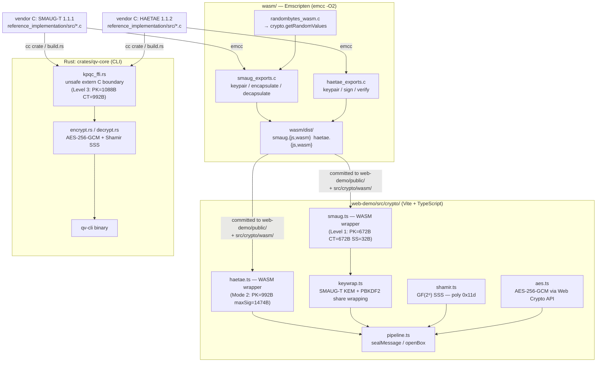
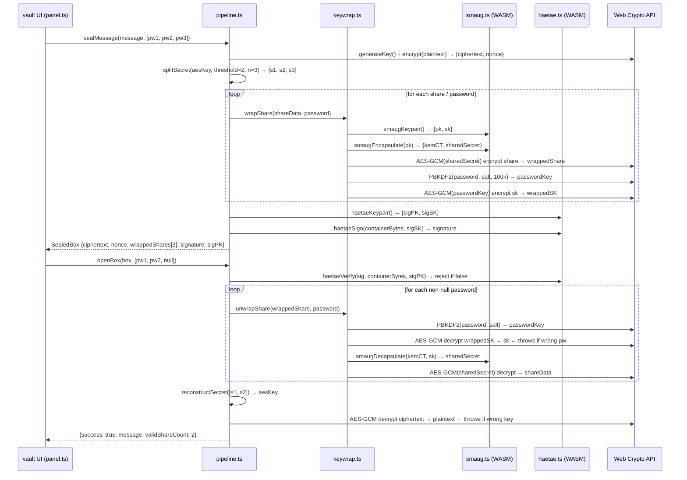

# Quantum Vault — Full Architecture

This document covers the complete system architecture from the C reference
implementations through the Rust FFI layer, WASM compilation, TypeScript
bridge, and browser-rendered demo UI.

---

## 1. System Overview

There are two independent build paths that share the vendor C sources:

- **Web demo** — C reference implementations compiled directly to WebAssembly
  via Emscripten; TypeScript calls the WASM exports from a Vite + vanilla-TS
  browser app.
- **Rust CLI** — C reference implementations linked into `qv-core` via the
  `cc` crate; the binary is `qv-cli`.



---

## 2. Web Demo Seal / Open Data Flow



### Key type definitions

```typescript
interface SealedBox {
  ciphertext:   Uint8Array;   // AES-256-GCM output (payload + 16-byte tag)
  nonce:        Uint8Array;   // 12-byte random IV
  wrappedShares: WrappedShare[]; // one per keyholder (always 3)
  signature:    Uint8Array;   // HAETAE Mode 2 signature
  sigPublicKey: Uint8Array;   // HAETAE public key (992 B)
  createdAt:    string;       // ISO 8601 timestamp
}

interface WrappedShare {
  salt:             Uint8Array; // 16-byte PBKDF2 salt
  kemCiphertext:    Uint8Array; // SMAUG-T KEM ciphertext (672 B)
  wrappedShare:     Uint8Array; // AES-GCM encrypted Shamir share
  shareNonce:       Uint8Array; // 12-byte nonce for share encryption
  publicKey:        Uint8Array; // SMAUG-T public key (672 B)
  wrappedSecretKey: Uint8Array; // AES-GCM encrypted SMAUG-T SK
  skNonce:          Uint8Array; // 12-byte nonce for SK encryption
}

type OpenResult =
  | { success: true;  message: string;       validShareCount: number }
  | { success: false; gibberish: Uint8Array; validShareCount: number };
```

### Note on omitted AAD in AES-GCM calls

`aes.ts` and `keywrap.ts` call `SubtleCrypto.encrypt / decrypt` without
Additional Authenticated Data. This is intentional: the HAETAE signature in
`pipeline.ts` covers `buildContainerData(ciphertext, nonce, wrappedShares)` —
the concatenation of every byte of every field — so any substitution or
cross-container transplant is caught before decryption. Inner AES-GCM calls
(share wrap, SK wrap) are protected by the outer HAETAE verify; they do not
need independent AAD.

---

## 4. FFI Safety Invariants

All unsafe FFI is confined to [`crates/qv-core/src/crypto/backend/kpqc_ffi.rs`](../crates/qv-core/src/crypto/backend/kpqc_ffi.rs).
The public functions in that module are **safe Rust** wrappers; the `unsafe` keyword is only used at the `extern "C"` call site inside each function body.

### SMAUG-T boundaries

| Function | C symbol | Pointer invariants |
|----------|----------|--------------------|
| `smaug_t_keypair()` | `cryptolab_smaugt_mode3_keypair` | `pk` points to `≥ SMAUG_T_PK_BYTES` (1088) initialised allocation; `sk` to `≥ SMAUG_T_SK_BYTES` (1312). Both must remain valid for the duration of the call. Rust allocates both on the stack as `vec![0u8; N]` before the call. |
| `smaug_t_enc(pk)` | `cryptolab_smaugt_mode3_enc` | `pk` must be exactly `SMAUG_T_PK_BYTES` (checked before the call). `ct` and `ss` are freshly allocated output buffers. |
| `smaug_t_dec(sk, ct)` | `cryptolab_smaugt_mode3_dec` | Both `sk` and `ct` are validated for exact byte lengths before the call. The C function reads them as `const` pointers; no aliasing with the output `ss`. |

### HAETAE boundaries

| Function | C symbol | Pointer invariants |
|----------|----------|--------------------|
| `haetae_keypair()` | `cryptolab_haetae_mode3_keypair` | `vk` → `≥ HAETAE_PK_BYTES` (1472); `sk` → `≥ HAETAE_SK_BYTES` (2112). Rust-allocated vecs, distinct allocations, no aliasing. |
| `haetae_sign(sk, message)` | `cryptolab_haetae_mode3_signature` | `sig` is allocated as `vec![0u8; HAETAE_SIG_BYTES]` (2349). `siglen` is a stack `usize` passed by mutable pointer — C writes the actual length. `ctx` and `ctxlen` are `null` / `0` (no signing context). `sk` is validated for exact length. After return, `sig` is truncated to `*siglen`. |
| `haetae_verify(pk, message, signature)` | `cryptolab_haetae_mode3_verify` | `pk` validated to `HAETAE_PK_BYTES`. Signature length checked to be `≤ HAETAE_SIG_BYTES` — prevents buffer over-read on the C side. `ctx` / `ctxlen` are `null` / `0`. Return value is the only output; no output pointers. |

### randombytes shim

`crates/qv-core/randombytes_shim.c` replaces the NIST KAT DRBG `randombytes.c`
that ships with both C reference implementations. The vendor file is excluded
from the `cc::Build` file list in `build.rs` and replaced by the shim, which
sources entropy from:

- **Linux:** `getrandom(buf, len, 0)` (syscall, no fd required)
- **macOS / BSD:** `arc4random_buf(buf, len)`
- **Fallback:** reads from `/dev/urandom`; calls `abort()` on read failure

This ensures no KAT DRBG entropy ever enters a production binary.

---

## 5. Container Format (AAD-Protected)

See [docs/container-format.md](container-format.md) for the full binary layout.

The AES-256-GCM Additional Authenticated Data (AAD) covers the algorithm
identifiers, threshold, and version, preventing an attacker from silently
substituting algorithm labels in the container header:

```json
{
  "kem_algorithm":  "<string>",
  "sig_algorithm":  "<string>",
  "threshold":      <integer>,
  "version":        <integer>
}
```

Fields are serialised in alphabetical (key-sorted) order in both Rust
(`serde_json::json!` with explicitly ordered keys) and TypeScript
(`JSON.stringify` with keys inserted in alphabetical order), guaranteeing
byte-identical AAD on both sides of the WASM boundary.

---

## 6. Security Level Parameters

The Rust `qv-core` CLI uses **Level 3** (NIST equivalent ~AES-192) via the
`mode3` C symbols.  The **web demo** uses **SMAUG-T Level 1** and **HAETAE
Mode 2** (NIST equivalent ~AES-128) for smaller key / ciphertext sizes.

| Parameter | Rust CLI (Level 3) | Web Demo (Level 1 / Mode 2) |
|-----------|-------------------|----------------------------|
| SMAUG-T public key | 1088 B | 672 B |
| SMAUG-T secret key | 1312 B | 832 B |
| SMAUG-T ciphertext | 992 B | 672 B |
| SMAUG-T shared secret | 32 B | 32 B |
| HAETAE public key | 1472 B | 992 B |
| HAETAE secret key | 2112 B | 1408 B |
| HAETAE max signature | 2349 B | 1474 B |
| AES-GCM key | 256 bits | 256 bits |
| AES-GCM nonce | 96 bits (12 B) | 96 bits (12 B) |
| AES-GCM tag | 128 bits (16 B) | 128 bits (16 B) |
| Shamir field | GF(256) poly `0x11d` | GF(256) poly `0x11d` |
